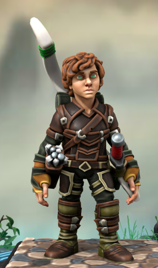
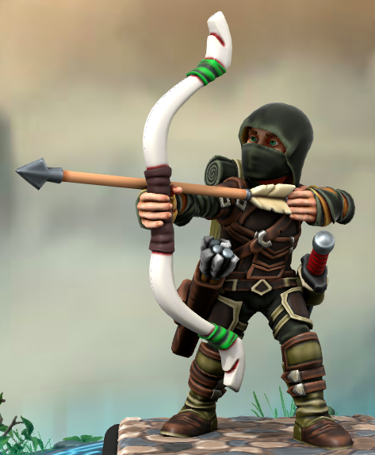
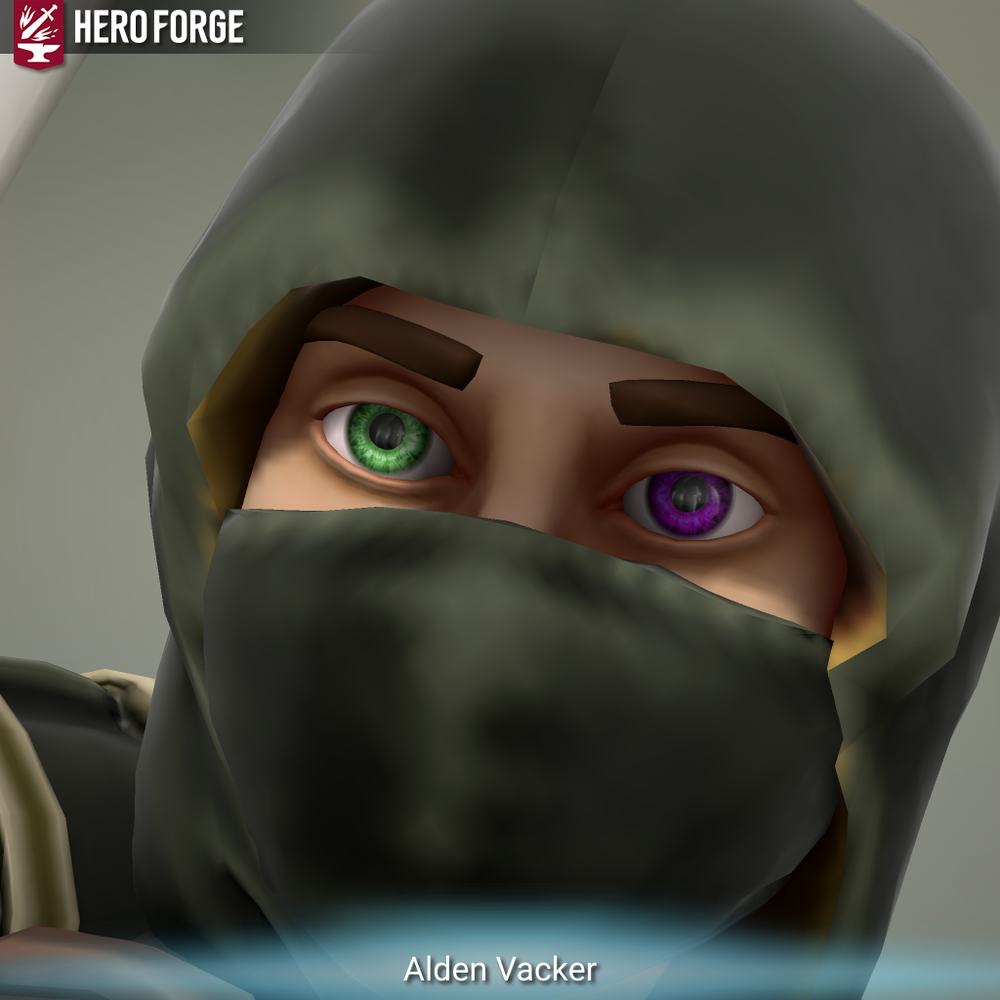

# Alden Vacker

**Alden Vacker** is a tracker from the [Eastern Forests](../../../ch-4-esterfell-gazetteer/lenya/eastern-forests.md).

<figure>
  
  <figcaption>Alden - Ranger 4 by Aeden Berman</figcaption>
</figure>

## Information

### Mental

- pronouns: he/him

### Physical

- species: stout halfling
- age: 35
- height: 2'11"
- weight: 39 lb.
- eyes: blue
- hair: black

## History

### Childhood

Alden grew up feral among the wild creatures of the Eastern Forests, not knowing or remembering his parents or other family. He tended to stay far away from civilized settlements, opting for the beasts and plants with which he was more familiar.

As a teenager, Alden came upon [Rowan Dundragon](rowan-dundragon.md), and in assisting her with navigating the forest, he found a new calling to act as a guide for wayward travelers. For many years after that he continued to guide folk through the Eastern Forests, but over time this new exposure to the people of [Lenya](../../../ch-4-esterfell-gazetteer/lenya/lenya.md) inspired him to learn more of the lands outside his familiar woods, so he set out with Rowan to explore the rest of [Esterfell](../../../ch-4-esterfell-gazetteer/esterfell.md).

### Adulthood

The adventuring duo eventually crossed paths with [The Commune](../the-commune.md), and the groups banded together to investigate strange occurrences in [Middlestag Forest](../../../ch-4-esterfell-gazetteer/lenya/middlestag-forest.md).

While trying to find a way out of the [Feywild](../../../cosmology/feywild.md) counterpart of Middlestag, Alden made a deal with [Plosh](../../unseelie-court/plosh.md) the [snot hag](../../../ch-7-mote-bestiary/snot-hag.md) and was granted the gift of Devil's Sight.
