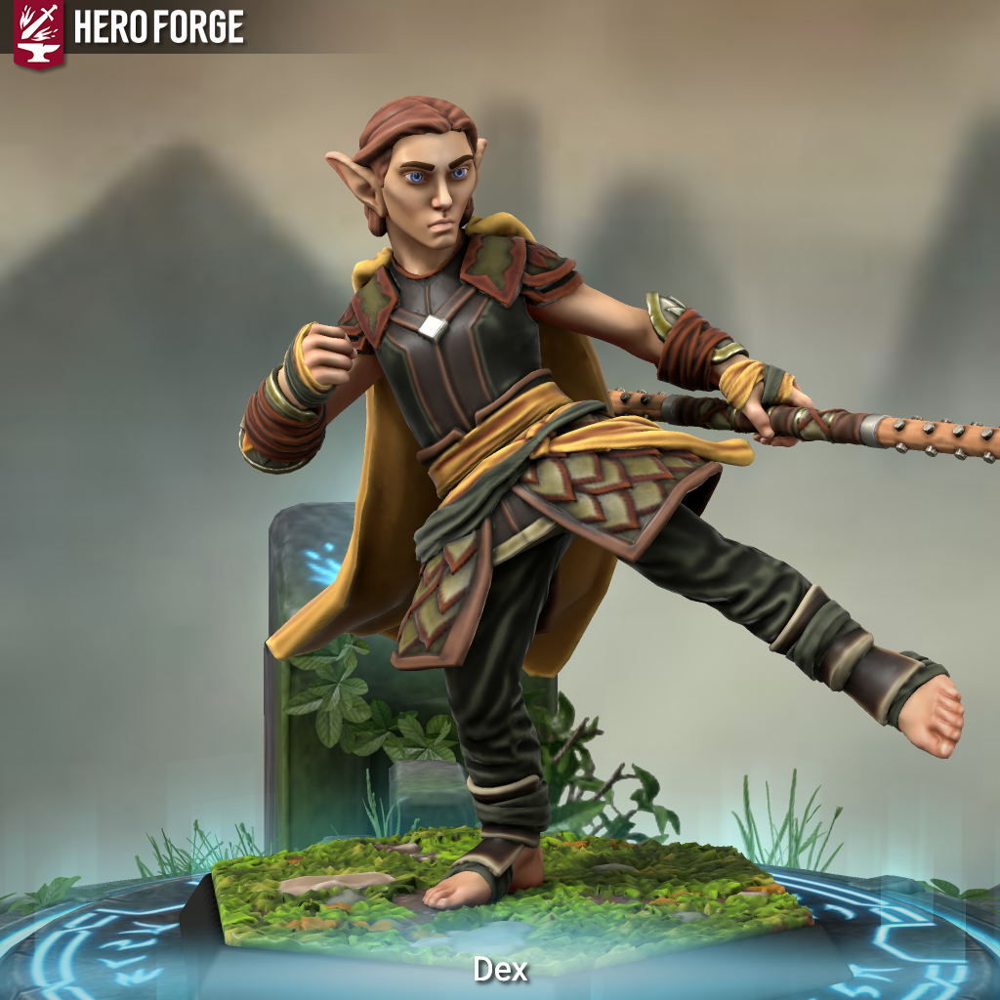
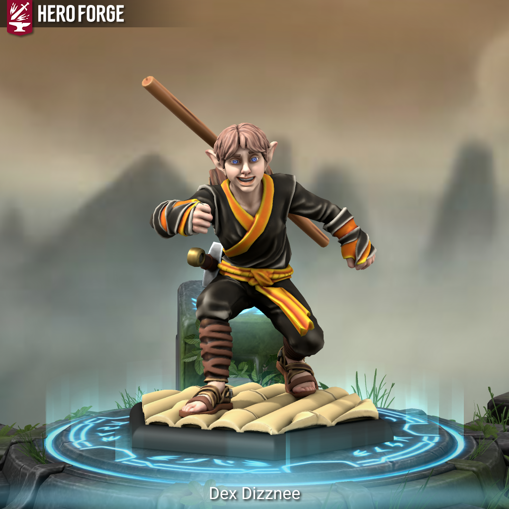

# Dex

**Dex** is a former student of the [Shorsta-Halasma](../../shorsta-halasma/shorsta-halasma,d) who has continued his monk studies independently.

<figure>
  
  <figcaption>Dex - Monk 5 by Dylan Berman</figcaption>
</figure>

## Information

### Mental

- pronouns: he/him

### Physical

- species: wood elf

## Relationships

### Family

- [Gilvaris Rainfall](../../../ch-2-people-of-mote/societies/verdancy/citizenry/gilvaris-rainfall.md): mother (deceased)
- [Yelpetor Ruser](../../../ch-2-people-of-mote/societies/verdancy/citizenry/yelpetor-ruser.md): father
- [Loemi Rainfall](../../../ch-2-people-of-mote/societies/verdancy/citizenry/loemi-rainfall.md): older sister
- [Tharis Ruser](../../../ch-2-people-of-mote/societies/verdancy/citizenry/tharis-ruser.md): younger brother
- [Arn Ruser](../../../ch-2-people-of-mote/societies/verdancy/citizenry/arn-ruser.md): younger brother
- [Ving Ruser](../../../ch-2-people-of-mote/societies/verdancy/citizenry/ving-ruser.md): youngest brother
- [Rara Rainfall](../../../ch-2-people-of-mote/societies/verdancy/citizenry/rara-rainfall.md): youngest sister

### Shorsta-Halasma

- [Gilliwyn Shadowbrook](../../shorsta-halasma/members/gilliwyn-shadowbrook.md): childhood best friend
- [Rovahm](../../shorsta-halasma/members/rovahm.md): former mentor
- [Vilas Bolderfury](../../shorsta-halasma/members/vilas-boulderfury.md): childhood rival

## History

### Childhood

Dex was born to Gilvaris Rainfall and Yelpetor Ruser in the [Eastern Forests](../../../ch-4-esterfell-gazetteer/lenya/eastern-forests.md). From an early age, Dex showed an aptitude for hand-to-hand combat. His family desired to help him hone his skills through mental discipline, so they enrolled him in the Shorsta-Halasma monastery. Dex excelled in his studies in the ways of shadow and stealth, but his rebellious streak often got him in trouble with his teachers. He believed that this ultimately led to him being kicked out of the monastery, though the true nature of his departure was not revealed to him at that time.

After being kicked out of the monastery, Dex wandered the [Verdancy](../../../ch-2-people-of-mote/societies/verdancy) for eight years before being discovered by his mother. She agreed to meet with him weekly, and they continued to meet in secret for twenty years, but Dex was so overcome with shame over being expelled that he refused to make contact with his dad or siblings, including his youngest sister Rara, who he had never met as she was born after he joined the school.

### Adulthood

Then, a kobold attack on his old village left his mother extremely weak, and eventually dead. In an effort to avenge her, he tracked the kobolds back to their den, recently exposed by a quarry in the [Open Fields](../../../ch-4-esterfell-gazetteer/lenya/open-fields.md). While exploring the den, a cavern collapse left Dex trapped inside. He was soon discovered by [The Commune](../the-commune.md). After they helped him escape the den, Dex decided to join the adventuring group as they investigated strange occurrences in [Middlestag Forest](../../../ch-4-esterfell-gazetteer/lenya/middlestag-forest.md).

Because of his expulsion from the Shorsta-Halasma, Dex has not yet completed the construction of his [staff of Shorsta](../../../ch-6-mote-treasures/magic-items/staff-of-shorsta.md).
