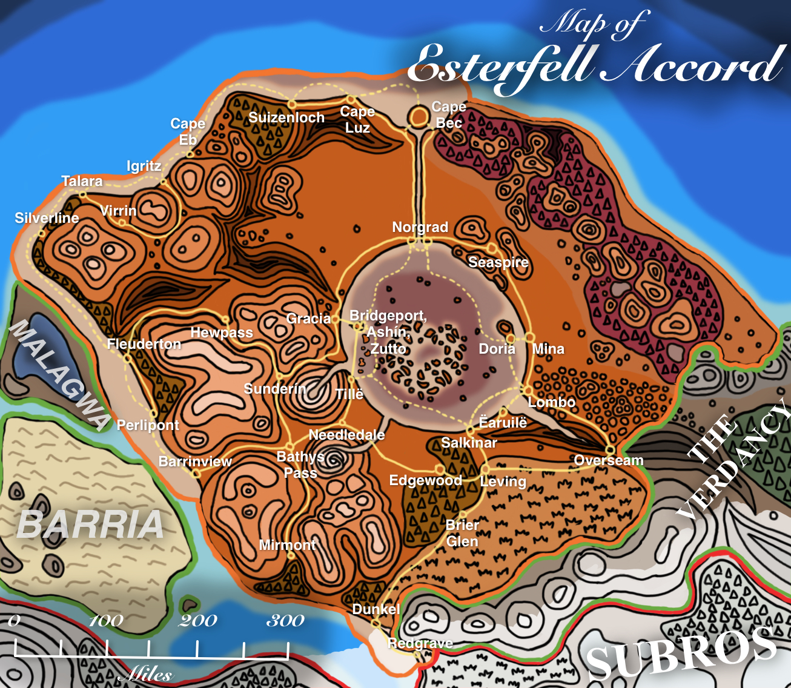
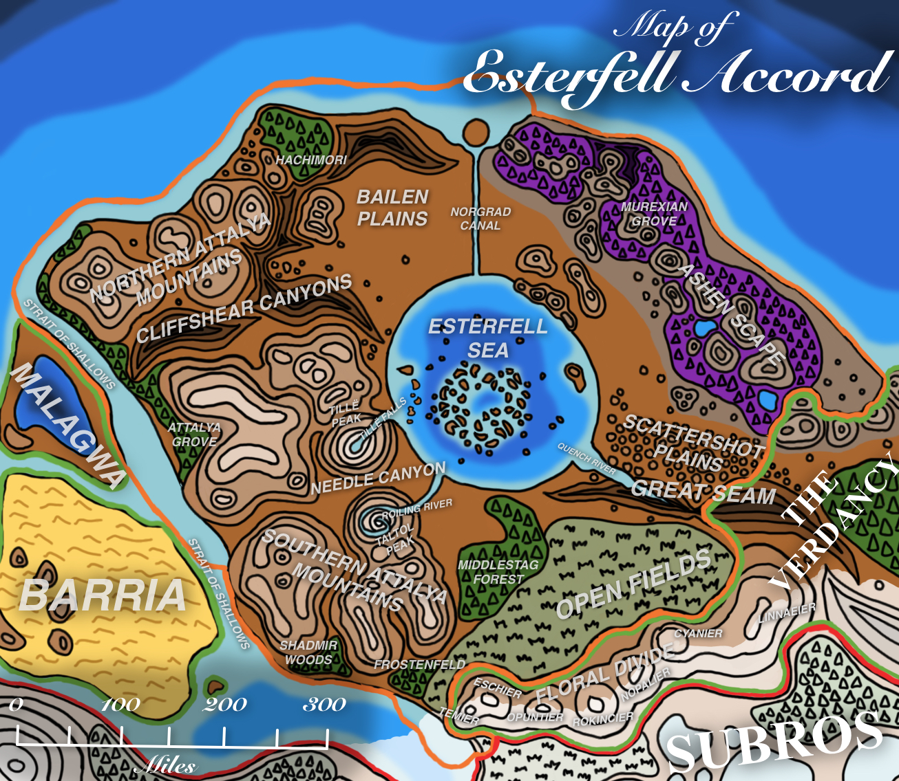

# Esterfell Accord

The **Esterfell Accord** is a nation in [Lenya](../../../ch-4-esterfell-gazetteer/lenya/lenya.md). This country was formed from an alliance of multiple progenitor tribes, which were mostly insular cultural groups prior to the alliance. By uniting under a common banner, the Accord was able to increase its power and influence while strengthening its hold on the [Esterfell Sea](../../../ch-4-esterfell-gazetteer/lenya/esterfell-sea/esterfell-sea.md) and the [Murexian Grove](../../../ch-4-esterfell-gazetteer/lenya/murexian-grove.md), locations of great strategic importance due to the rare natural resources they contain.

<figure>
  
  <figcaption>Esterfell Accord Political Map by <a href="https://mario.panighetti.net">Mario Panighetti</a></figcaption>
</figure>

<figure>
  
  <figcaption>Esterfell Accord Natural Map by <a href="https://mario.panighetti.net">Mario Panighetti</a></figcaption>
</figure>

## Information

- **Capital:** [Cape Bec](cape-bec/cape-bec.md)
- **Demonyms:** Esterfolk
