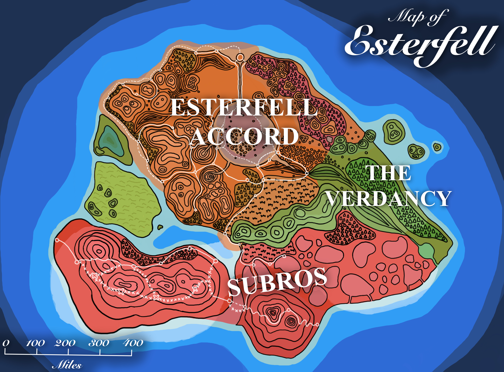
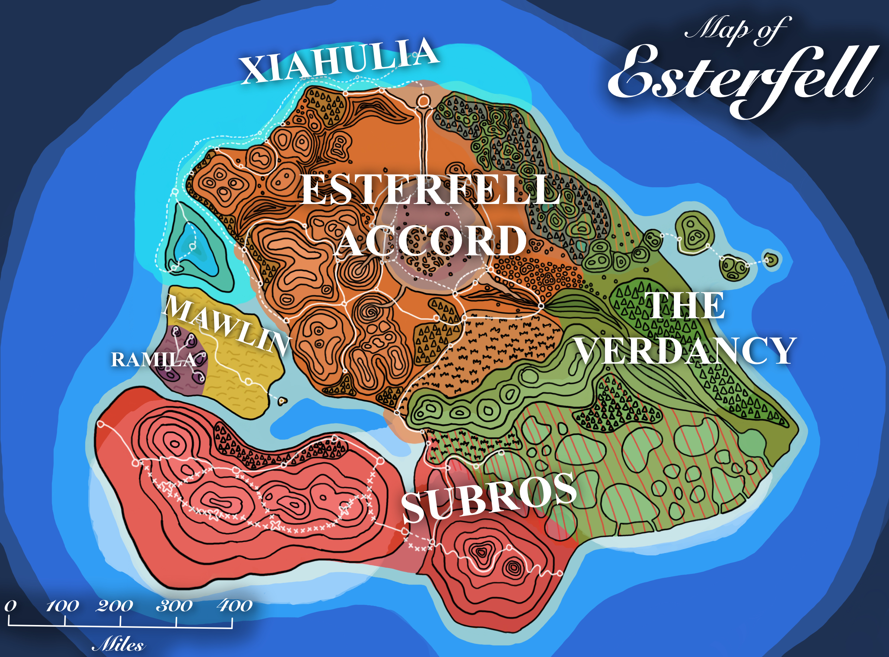

# Societies of Esterfell

[Esterfell](../ch-4-esterfell-gazetteer/esterfell/) has multiple distinct societies, some of which are organized into larger nations.

- [Esterfell Accord](esterfell-accord/)
- [Subros](subros/)
- [Xiahulia](xiahulia.md)
- [Mawlin](mawlin.md)
- [Ramila](ramila.md)

In addition, a large region of [Lenya](../ch-4-esterfell-gazetteer/esterfell/lenya/) is not considered to be under direct control of any of the above societies. This land is generally referred to as [Verdancy](verdancy/) territory and acts as a region not under active development or conquest from the Accord or Subros. Those two nations often categorize all lands outside their domains as Verdancy, ignoring the people and political structures that exist within those spaces and resulting in inaccurate maps and domain knowledge.

<figure>
  
  <figcaption>Esterfell False Political Map by <a href="https://mario.panighetti.net">Mario Panighetti</a></figcaption>
</figure>

<figure>
  
  <figcaption>Esterfell Political Map by <a href="https://mario.panighetti.net">Mario Panighetti</a></figcaption>
</figure>
