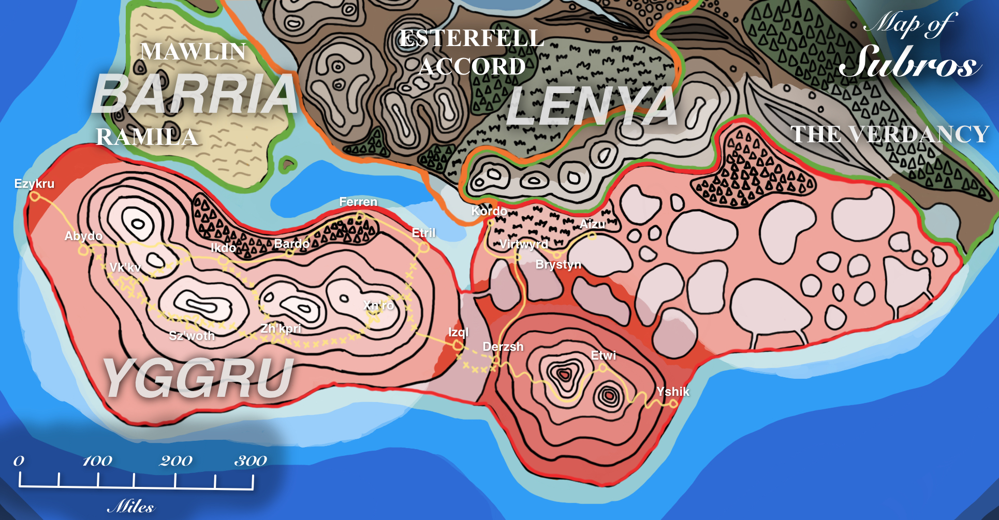

# Subros

**Subros** is a nation occupying [Yggru](../../../ch-4-esterfell-gazetteer/esterfell/yggru/) and the southern region of [Lenya](../../../ch-4-esterfell-gazetteer/esterfell/lenya/) surrounding [Mount Hora](../../../ch-4-esterfell-gazetteer/esterfell/lenya/mount-hora.md).

<figure>
  
  <figcaption>Subros Political Map by <a href="https://mario.panighetti.net">Mario Panighetti</a></figcaption>
</figure>

## Information

- **Demonyms:** Subrosians

## Etymology

The nation's name comes from a pre-Esterfell human language phrase "sub rosa" meaning "under the rose", referring to the red glow from Mount Hora's crater that is said to conceal the shadows of southern [Esterfell](../../../ch-4-esterfell-gazetteer/esterfell/) in secrecy.

> [!NOTE]
> This name is a reference to [sub rosa](https://en.wikipedia.org/wiki/Sub_rosa) as a historical symbol of secrecy.
