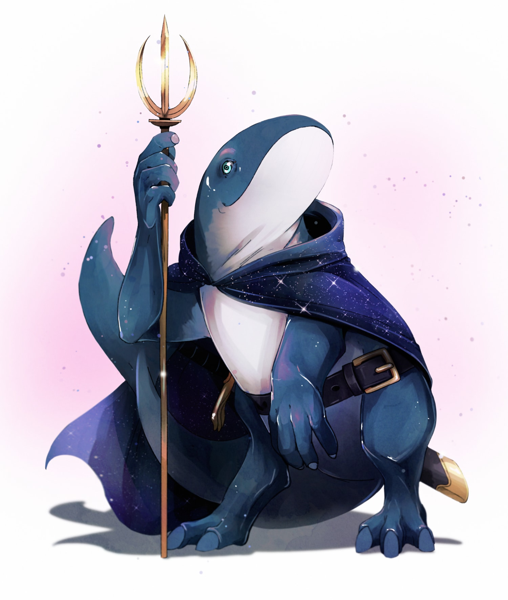

# [Cetean](https://github.com/mpanighetti/dnd5e-species/blob/main/humanoids/)

## Description

**Ceteans** are a whalefolk species who explore [Mote](../../../ch-1-welcome-to-mote/cosmology/mote.md) and [Fellspace](../../../ch-1-welcome-to-mote/cosmology/fellspace.md) in the pursuit of knowledge and starstuff.

<figure>
  
  <figcaption>Ooeeoo by <a href="https://linktr.ee/hollycircling">Nikki Lacey</a></figcaption>
</figure>

## Distribution

Ceteans originate from distant regions of Fellspace, where they swam through [starstuff](../../ch-6-mote-treasures/starstuff.md) nebulas and thrived off of the material's magical nourishment. These free-flying pods were drawn to the starstuff regularly bombarding Mote, and eventually took up permanent residence in the world's bountiful oceans. The gift of Echospeak possessed by all ceteans meant that even when these groups forever left the realm of Fellspace, they continued to communicate with their stellar brethren and share knowledge with the wider cetean community.

After a massive starstuff asteroid impacted with Esterfell, many cetean pods came to the new land, eventually becoming founding members of the nation of [Xiahulia](../../../ch-2-people-of-mote/societies/xiahulia.md).

Multiple pods of ceteans reside within the [oceans](../../../ch-4-esterfell-gazetteer/coasts-of-esterfell) surrounding [Esterfell](../../../ch-4-esterfell-gazetteer/esterfell/), with the largest groups settling along the northern coasts of [Lenya](../../../ch-4-esterfell-gazetteer/esterfell/lenya/). They mostly stay away from the continent's landbound societies, but occasionally can be found in port cities to engage in trade.

## Traits

- _**Creature Type:**_ Humanoid
- _**Size:**_ Medium (6-9 feet tall)
- _**Speed:**_ 30 feet, swim 30 feet

As a cetean, you have the following special traits.

_**Echospeak.**_ Without the assistance of magic, the baleen structures in your mouth make it difficult to speak the non-cetean languages you know. Instead, you primarily use a telepathic technique known as Echospeak to convey your thoughts. You have the magical ability to transmit your thoughts mentally to willing creatures you can see within 120 feet of yourself. A contacted creature doesn't need to share a language with you to understand your thoughts, but they must be able to understand at least one language. Your telepathic link to a creature is broken if you and the creature move more than 120 feet apart, if either of you is incapacitated, or if either of you mentally breaks the contact (no action required).

_**Hold Breath.**_ You can hold your breath for up to 1 hour.

_**Large Build.**_ You have advantage on Strength-based ability checks and Strength Saving Throws. In addition, you count as one size larger when determining your carrying capacity and the weight you can push, drag, or lift.

_**Whalesong.**_ You can use your Echospeak to connect to other members of your pod over great distances, benefitting from shared knowledge carried through your people's collective whalesong. Whenever you finish a Long Rest, you gain Proficiency in one skill of your choice. You acquire this Proficiency by drawing from shared cetean knowledge, and you retain it until you finish your next Long Rest.
